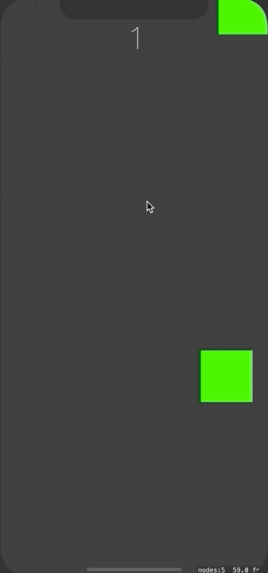

## Intro To SpriteKit
### Pop the Squares
A game that keeps track of how many squares the user can tap. Squares that are tapped disappear and count as 1 point.

### Technologies
- Swift
- SpriteKit

### Demo
